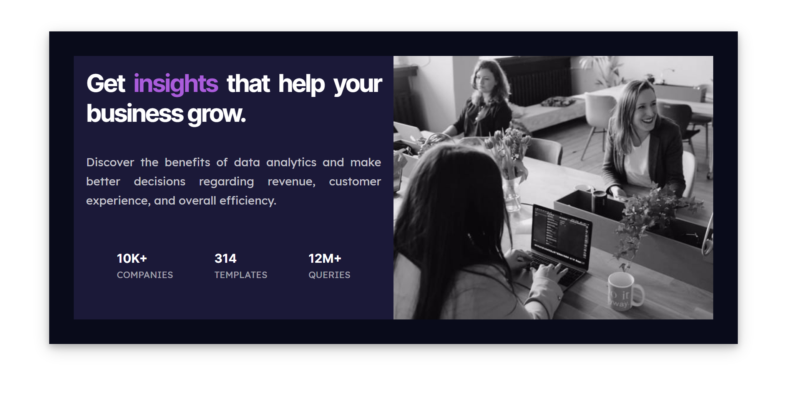

This is a solution to the [Stats preview card component ](https://www.frontendmentor.io/challenges/stats-preview-card-component-8JqbgoU62).

## Table of contents

- [Overview](#overview)
  - [The challenge](#the-challenge)
  - [Screenshot](#screenshot)
  - [Links](#links)
  - [Built with](#built-with)
  - [What I learned](#what-i-learned)
  - [Continued development](#continued-development)

## Main Overview

The overview of the project is to build out the landing page of susnnyside creative site. The site is responsive for both mobile,tablet and a desktop version of the design.

### The challenge

Users should be able to:

- View the optimal layout for the site depending on their device's screen size
- See hover states for all interactive elements on the page
  The designs were created to the following widths:

- Mobile: 375px
  -Tablet: 768px
- Desktop: 1440px

### Screenshot




### Links

- Solution URL: [solution URL ](https://github.com/victoriaodemakin/Preview-card/)
- Live Site URL: [live site URL ](https://victoriaodemakin.github.io/Preview-card/)

## My process

### Built with

- Semantic HTML5 markup
- CSS custom properties
- Flexbox
- CSS Grid
- Mobile-first workflow

To see how you can add code snippets, see below:

```html
 <body>
    <main>
      <section>
        <div class="container">
          <div class="text">
            <h1>Get <span>insights</span> that help your business grow.</h1>
            <p>
              Discover the benefits of data analytics and make better decisions
              regarding revenue, customer experience, and overall efficiency.
            </p>
            <ul>
              <li>
                10k+ <span> <br />companies</span>
              </li>
              <li>
                314 <span> <br />templates</span>
              </li>
              <li>
                12m+
                <span
                  ><br />
                  queries</span
                >
              </li>
            </ul>
```

```css
.overlay {
    width: 100%;
    background: hsl(277, 44%, 59%);
  }

  .overlay-image::after {
    content: "";
    inset: 0;
    background-color: purple;
    opacity: 0.9;
  }

  .overlay-image {
    display: block;
    width: 100%;
  }

```


### Continued development

All other future projects will be focused on using Vue.Js Framework.which is found useful that to refine and perfect future project
